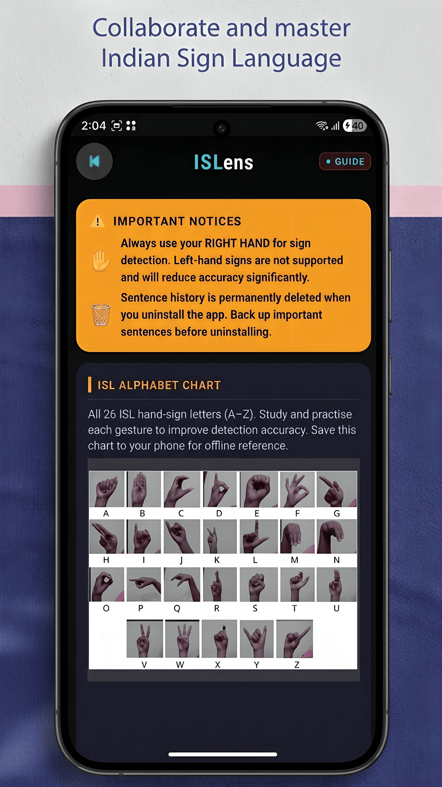
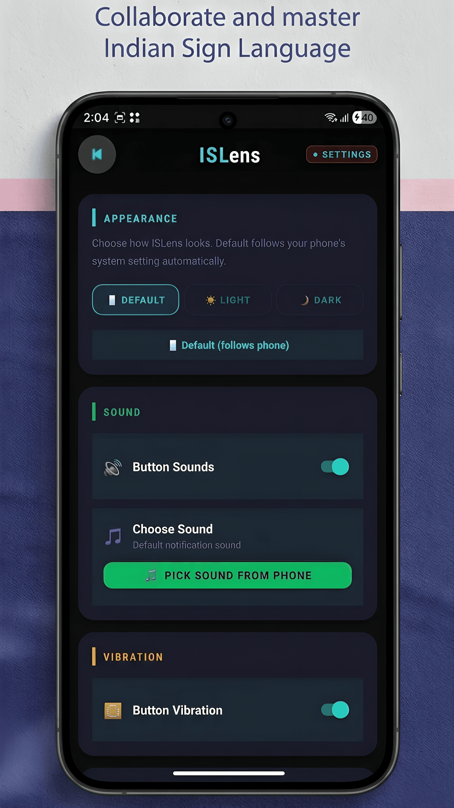
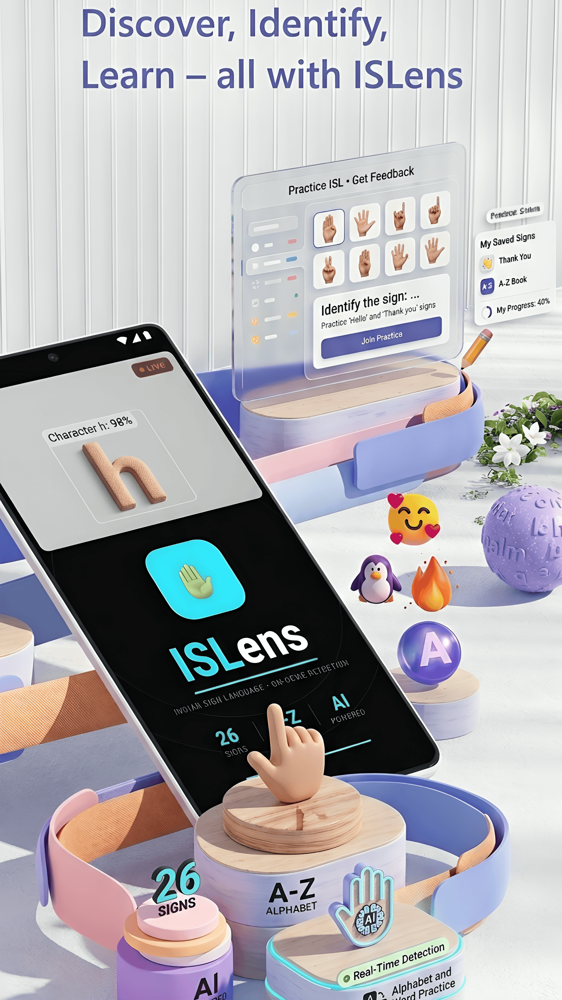

# 🤟 ISLens — Real-Time Indian Sign Language Detection

<p align="center">
  
  
  
  
  
  
</p>

<p align="center">
  A real-time <strong>Indian Sign Language (ISL)</strong> recognition Android app that detects all <strong>26 alphabet signs (A–Z)</strong> live from the device camera — powered by <strong>TensorFlow Lite</strong> and <strong>Google MediaPipe</strong> hand landmark detection.
</p>

---

## 📸 Screenshots

<p align="center">
  
  
  
  
</p>

<p align="center">
  
  
</p>

---

## ✨ Features

| Feature | Description |
|---|---|
| 🎥 **Live Camera Detection** | Real-time sign recognition using CameraX |
| 🤚 **Hand Landmark Extraction** | 21 keypoints per hand via MediaPipe Tasks Vision |
| 🧠 **On-Device TFLite Model** | No internet required for inference |
| 🔤 **26 ISL Signs (A–Z)** | Complete Indian Sign Language alphabet |
| 🌍 **58-Language Translation** | Translate recognized text to any language |
| 🔊 **Text-to-Speech** | Speak out recognized signs automatically |
| 📜 **Sentence History** | Build full words and sentences from letters |
| 🔴 **LIVE Badge** | Infinite blinking animation during active session |
| ⚙️ **Settings Screen** | Configurable detection preferences |
| 📖 **Guide Screen** | In-app usage guide for new users |
| 💬 **Feedback Screen** | Built-in feedback submission |
| 📥 **Download Manager** | Smart language pack downloader with progress dialog |

---

## 📂 Full Project File Structure

```
ISLens/
├── app/
│   ├── src/
│   │   └── main/
│   │       ├── assets/
│   │       │   ├── isl_ultimate.tflite          ← TFLite model (download separately)
│   │       │   ├── hand_landmarker.task          ← MediaPipe hand landmark model
│   │       │   └── labels.txt                   ← Class labels (A–Z)
│   │       │
│   │       ├── java/com/yourpackage/islvision/
│   │       │   ├── MainActivity.java             ← App entry point & home screen
│   │       │   ├── SignLanguageClassifier.java   ← TFLite inference engine
│   │       │   ├── LanguageManager.java          ← 58-language translation manager
│   │       │   ├── MyMemoryTranslator.java       ← Translation API integration
│   │       │   ├── DownloadHelper.java           ← Language pack downloader
│   │       │   ├── DownloadService.java          ← Background download service
│   │       │   ├── HistoryActivity.java          ← Sentence history screen
│   │       │   ├── SettingsActivity.java         ← App settings screen
│   │       │   ├── GuideActivity.java            ← In-app guide screen
│   │       │   ├── FeedbackActivity.java         ← Feedback submission screen
│   │       │   ├── SplashActivity.java           ← Launch splash screen
│   │       │   └── TermsActivity.java            ← Terms & conditions screen
│   │       │
│   │       ├── res/
│   │       │   ├── layout/
│   │       │   │   ├── activity_main.xml
│   │       │   │   ├── activity_realtime_camera.xml
│   │       │   │   ├── activity_home.xml
│   │       │   │   ├── activity_history.xml
│   │       │   │   ├── activity_settings.xml
│   │       │   │   ├── activity_guide.xml
│   │       │   │   ├── activity_feedback.xml
│   │       │   │   ├── activity_splash.xml
│   │       │   │   ├── activity_terms.xml
│   │       │   │   ├── bottom_sheet_reference.xml
│   │       │   │   ├── custom_red_toast.xml
│   │       │   │   ├── dialog_download_progress.xml
│   │       │   │   ├── dialog_language.xml
│   │       │   │   ├── dialog_language_picker.xml
│   │       │   │   ├── dialog_reference.xml
│   │       │   │   ├── item_history.xml
│   │       │   │   └── item_language_simple.xml
│   │       │   └── ...
│   │       │
│   │       └── AndroidManifest.xml
│   │
│   └── build.gradle                             ← App-level Gradle (dependencies here)
│
├── screenshots/                                 ← App screenshots for README
│   ├── ISL-Image-3.png
│   ├── ISL-Image-4.png
│   ├── ISL-image-5.png
│   ├── ISL-Image-23.png
│   ├── ISL-Image-66.png
│   └── ISL-Image-111.png
│
├── build.gradle                                 ← Project-level Gradle
├── train_FINAL_RESUMABLE.py                     ← Python training script for TFLite model
└── README.md
```

---

## ⚙️ Prerequisites

Before you begin, make sure you have the following installed:

- ✅ **Android Studio** — Hedgehog (2023.1.1) or newer  
  👉 [Download Android Studio](https://developer.android.com/studio)
- ✅ **JDK 17** (bundled with Android Studio)
- ✅ **Android SDK** — API Level 24 or higher
- ✅ **Git** — for cloning the repository  
  👉 [Download Git](https://git-scm.com/)
- ✅ **Python 3.8+** *(only if you want to retrain the model)*

---

## 🚀 Step-by-Step Setup Guide

### Step 1 — Clone the Repository

Open a terminal and run:

```bash
git clone https://github.com/HelloWorld-Farhan/ISLens.git
cd ISLens
```

Or download the ZIP directly from GitHub:
> Click **Code → Download ZIP** → Extract the folder

---

### Step 2 — Download the Dataset & Model Files

The TFLite model file (`isl_ultimate.tflite`) and the MediaPipe hand landmark model (`hand_landmarker.task`) are **not stored in the repository** due to their large size. You must download them separately.

#### 📦 Download from Google Drive

👉 **[Click here to download the model & dataset](https://drive.google.com/file/d/1t8bvH6cmYQKMiKs_fHayEOtiZFcRmDkY/view?usp=sharing)**

**How to download:**

1. Open the link above in your browser
2. If prompted, sign in with your Google account
3. Click the **⬇️ Download** button at the top-right of the page
4. If a warning appears saying *"Google can't scan this file for viruses"*, click **Download anyway** — this is normal for large files
5. Wait for the download to complete

**After downloading, place the files as follows:**

```
app/
└── src/
    └── main/
        └── assets/
            ├── isl_ultimate.tflite       ← Place here
            ├── hand_landmarker.task      ← Place here
            └── labels.txt               ← Already in the repo
```

> ⚠️ **Important:** The `assets/` folder must be inside `app/src/main/`. If it doesn't exist, create it manually:  
> In Android Studio → Right-click `main` → **New → Folder → Assets Folder**

---

### Step 3 — Open the Project in Android Studio

1. Launch **Android Studio**
2. Click **"Open"** (or `File → Open`)
3. Navigate to the cloned `ISLens` folder and click **OK**
4. Wait for **Gradle sync** to complete (this may take a few minutes the first time)
5. If prompted to update Gradle or plugins, click **"Don't remind me again"** or accept the update

---

### Step 4 — Add Gradle Dependencies

Open `app/build.gradle` and make sure the `dependencies` block contains the following. Replace or merge with your existing dependencies:

```groovy
dependencies {
    implementation 'androidx.appcompat:appcompat:1.7.0'
    implementation 'com.google.android.material:material:1.12.0'
    implementation 'androidx.constraintlayout:constraintlayout:2.2.1'

    // TensorFlow Lite — on-device ISL model inference
    implementation 'org.tensorflow:tensorflow-lite:2.14.0'
    implementation 'org.tensorflow:tensorflow-lite-support:0.4.4'

    // CameraX — live camera preview and frame capture
    implementation 'androidx.camera:camera-camera2:1.4.2'
    implementation 'androidx.camera:camera-lifecycle:1.4.2'
    implementation 'androidx.camera:camera-view:1.4.2'

    // MediaPipe — hand landmark detection (21 keypoints)
    implementation 'com.google.mediapipe:tasks-vision:0.10.14'

    // AndroidX Startup — for MediaPipe initialization
    implementation 'androidx.startup:startup-runtime:1.2.0'

    // Unit & UI Testing
    testImplementation 'junit:junit:4.13.2'
    androidTestImplementation 'androidx.test.ext:junit:1.2.1'
    androidTestImplementation 'androidx.test.espresso:espresso-core:3.6.1'
}
```

Also, make sure your `app/build.gradle` has the following inside the `android {}` block to prevent TFLite files from being compressed:

```groovy
android {
    ...
    aaptOptions {
        noCompress "tflite"
        noCompress "task"
    }
}
```

After making changes, click **"Sync Now"** in the top-right banner in Android Studio.

---

### Step 5 — Verify the AndroidManifest

Open `AndroidManifest.xml` and confirm the following permissions are present:

```xml
<!-- Camera access for live sign detection -->
<uses-permission android:name="android.permission.CAMERA" />

<!-- Internet access for translation feature -->
<uses-permission android:name="android.permission.INTERNET" />

<!-- For download service (language packs) -->
<uses-permission android:name="android.permission.FOREGROUND_SERVICE" />
<uses-permission android:name="android.permission.RECEIVE_BOOT_COMPLETED" />

<!-- Camera hardware feature declaration -->
<uses-feature android:name="android.hardware.camera" android:required="true" />
```

---

### Step 6 — Build & Run the App

#### Option A — Run on a Physical Device (Recommended)

1. Enable **Developer Options** on your Android phone:
   - Go to `Settings → About Phone`
   - Tap **Build Number** 7 times rapidly
   - Go back to `Settings → Developer Options`
   - Enable **USB Debugging**
2. Connect your phone via USB cable
3. In Android Studio, select your device from the device dropdown
4. Click the ▶️ **Run** button (or press `Shift + F10`)
5. Grant **Camera** permission when prompted on the device

#### Option B — Run on an Emulator

> ⚠️ **Note:** Real-time hand gesture detection works **much better on a physical device**. The emulator does not have a real camera, so sign detection accuracy will be limited.

1. In Android Studio, click **Device Manager** (right side panel)
2. Create a new virtual device: **Pixel 6** with **API 33 or higher**
3. Start the emulator
4. Click the ▶️ **Run** button

---

## 🧠 Model Training (Optional)

If you want to retrain or fine-tune the ISL model yourself using the downloaded dataset:

### Requirements

```bash
pip install tensorflow numpy pandas scikit-learn mediapipe opencv-python
```

### Steps

1. Download and extract the dataset from the Google Drive link above
2. Place the dataset folder in the same directory as `train_FINAL_RESUMABLE.py`
3. Run the training script:

```bash
python train_FINAL_RESUMABLE.py
```

4. The script will:
   - Extract hand landmarks using MediaPipe from each image
   - Train a classification model on the 26 ISL signs
   - Export the trained model as `isl_ultimate.tflite`
5. Copy the generated `isl_ultimate.tflite` to `app/src/main/assets/`

> 💡 The training script supports **resumable training** — if interrupted, it will continue from the last checkpoint.

---

## 📲 App Flow & Screens

```
SplashActivity (Launch)
        ↓
TermsActivity (First-time only)
        ↓
MainActivity / HomeActivity
   ├── 📷 Real-Time Camera  →  activity_realtime_camera.xml
   │        └── Live sign detection with LIVE badge + result overlay
   ├── 📜 History           →  HistoryActivity.java
   │        └── View sentence history of recognized signs
   ├── 🌍 Language Picker   →  dialog_language_picker.xml
   │        └── Select from 58 languages for translation
   ├── ⚙️ Settings          →  SettingsActivity.java
   ├── 📖 Guide             →  GuideActivity.java
   └── 💬 Feedback          →  FeedbackActivity.java
```

---

## 🔧 Troubleshooting

### ❌ Gradle Sync Fails

- Go to `File → Invalidate Caches → Invalidate and Restart`
- Make sure you have a stable internet connection (dependencies download on first sync)
- Check that your JDK is set to version 17: `File → Project Structure → SDK Location → JDK`

### ❌ `isl_ultimate.tflite` Not Found / App Crashes on Start

- Confirm the file is placed at `app/src/main/assets/isl_ultimate.tflite`
- Confirm `aaptOptions { noCompress "tflite" }` is in your `app/build.gradle`
- Do a **Clean + Rebuild**: `Build → Clean Project` → `Build → Rebuild Project`

### ❌ Camera Permission Denied / Black Screen

- Go to your phone's `Settings → Apps → ISLens → Permissions → Camera → Allow`
- Make sure `<uses-permission android:name="android.permission.CAMERA" />` is in `AndroidManifest.xml`

### ❌ MediaPipe `hand_landmarker.task` Error

- Verify the file exists at `app/src/main/assets/hand_landmarker.task`
- Add `noCompress "task"` inside `aaptOptions` in `app/build.gradle`

### ❌ App Detects Signs Incorrectly

- Ensure good lighting — MediaPipe hand detection works best in well-lit environments
- Hold your hand **30–60 cm** away from the camera
- Make sure your hand is fully visible within the camera frame
- Use a plain, uncluttered background

### ❌ Translation Not Working

- Translation requires internet access — check your connection
- Confirm `<uses-permission android:name="android.permission.INTERNET" />` is in `AndroidManifest.xml`

---

## 🛠️ Tech Stack

| Component | Library / Tool |
|---|---|
| Language | Java |
| Camera | CameraX (camera-camera2, camera-lifecycle, camera-view) |
| Hand Detection | Google MediaPipe Tasks Vision 0.10.14 |
| Sign Classification | TensorFlow Lite 2.14.0 |
| TFLite Utilities | TensorFlow Lite Support 0.4.4 |
| Translation | MyMemory Translation API |
| Text-to-Speech | Android built-in `TextToSpeech` API |
| UI Framework | Material Design 3 |
| Min SDK | API 24 (Android 7.0) |
| Target SDK | API 34 (Android 14) |

---

## 📋 Permissions Summary

| Permission | Why It's Needed |
|---|---|
| `CAMERA` | Live hand gesture capture and detection |
| `INTERNET` | 58-language translation via MyMemory API |
| `FOREGROUND_SERVICE` | Background language pack downloads |

---

## 🗂️ ISL Sign Reference (A–Z)

The app recognizes the following 26 Indian Sign Language alphabet signs:

| A | B | C | D | E | F | G |
|---|---|---|---|---|---|---|
| H | I | J | K | L | M | N |
| O | P | Q | R | S | T | U |
| V | W | X | Y | Z | | |

> Reference images for each sign are available inside the app via the **Guide** screen.

---

## 👨‍💻 Authors

**Farhan Khalid** — Android Developer & ML Engineer  
📧 farhankhalid17968@gmail.com  
🔗 [LinkedIn](https://www.linkedin.com/in/farhan-khalid-117514259/)  
🐙 [GitHub](https://github.com/HelloWorld-Farhan)

---

## 📄 License

```
MIT License

Copyright (c) 2026 Farhan Khalid

Permission is hereby granted, free of charge, to any person obtaining a copy
of this software and associated documentation files (the "Software"), to deal
in the Software without restriction, including without limitation the rights
to use, copy, modify, merge, publish, distribute, sublicense, and/or sell
copies of the Software, and to permit persons to whom the Software is furnished
to do so, subject to the following conditions:

The above copyright notice and this permission notice shall be included in all
copies or substantial portions of the Software.

THE SOFTWARE IS PROVIDED "AS IS", WITHOUT WARRANTY OF ANY KIND, EXPRESS OR
IMPLIED, INCLUDING BUT NOT LIMITED TO THE WARRANTIES OF MERCHANTABILITY,
FITNESS FOR A PARTICULAR PURPOSE AND NONINFRINGEMENT.
```

---

## 🌟 Star This Repo

If you found this project helpful or interesting, please consider giving it a ⭐ on GitHub — it really helps!

---

<p align="center">Made with ❤️ in India — for accessibility, inclusion, and communication</p>
